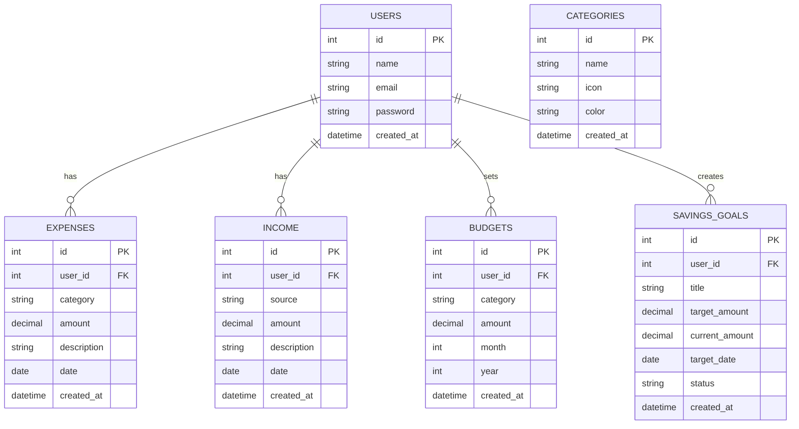

# ER Diagram (Mermaid)

```mermaid
erDiagram
    USERS {
        int id PK
        string name
        string email
        string password
        datetime created_at
    }
    EXPENSES {
        int id PK
        int user_id FK
        string category
        decimal amount
        string description
        date date
        datetime created_at
    }
    INCOME {
        int id PK
        int user_id FK
        string source
        decimal amount
        string description
        date date
        datetime created_at
    }
    CATEGORIES {
        int id PK
        string name
        string icon
        string color
        datetime created_at
    }
    BUDGETS {
        int id PK
        int user_id FK
        string category
        decimal amount
        int month
        int year
        datetime created_at
    }
    SAVINGS_GOALS {
        int id PK
        int user_id FK
        string title
        decimal target_amount
        decimal current_amount
        date target_date
        string status
        datetime created_at
    }
    USERS ||--o{ EXPENSES : has
    USERS ||--o{ INCOME : has
    USERS ||--o{ BUDGETS : sets
    USERS ||--o{ SAVINGS_GOALS : creates
``` 