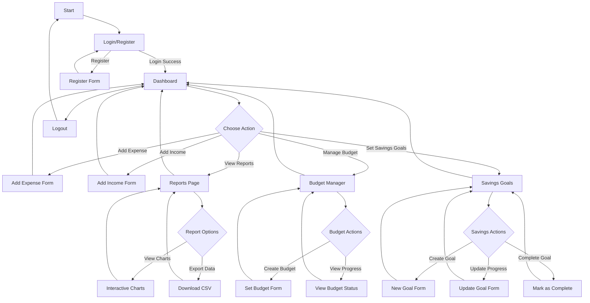

# System Flowchart (Mermaid)

```mermaid
flowchart TD
    A[Start] --> B[Login/Register]
    B -->|Login Success| C[Dashboard]
    C --> D{Choose Action}
    D -->|Add Expense| E[Add Expense Form]
    D -->|Add Income| F[Add Income Form]
    D -->|View Reports| G[Reports Page]
    D -->|Manage Budget| H[Budget Manager]
    D -->|Set Savings Goals| I[Savings Goals]
    E --> C
    F --> C
    G --> C
    H --> C
    I --> C
    B -->|Register| J[Register Form]
    J --> B
    C --> K[Logout]
    K --> A
    
    %% Budget Management Flow
    H --> H1{Budget Actions}
    H1 -->|Create Budget| H2[Set Budget Form]
    H1 -->|View Progress| H3[View Budget Status]
    H2 --> H
    H3 --> H
    
    %% Savings Goals Flow
    I --> I1{Savings Actions}
    I1 -->|Create Goal| I2[New Goal Form]
    I1 -->|Update Progress| I3[Update Goal Form]
    I1 -->|Complete Goal| I4[Mark as Complete]
    I2 --> I
    I3 --> I
    I4 --> I
    
    %% Reports Flow
    G --> G1{Report Options}
    G1 -->|View Charts| G2[Interactive Charts]
    G1 -->|Export Data| G3[Download CSV]
    G2 --> G
    G3 --> G
``` 